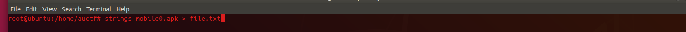

# AUCTF-2020
Writeups for some of the challenges from AUCTF 2020. My first time doing writeups for a CTF. 

## Web Challenges:

1. __Miyazaki Trivia__
    - So we open up the website in a browser and we see this:
    
    - So when thinking of special files, the first thing that came to my mind was robots.txt. Lets try it!
    
    - Now we can follow the directions given. First we google the answer to the trivia. Then we create a header using BurpSuite called answer with the data "Fear the Old Blood"
    - The flag is: auctf{f3ar_z_olD3_8l0oD}
2. __Quik Maths__
    - Interesting a calculator. if you don't input anything you get this:
    
    - We can easily solve this using the php system function
    - Input `system("grep -r auctf")`
    
    - The flag is: auctf{p6p_1nj3c7i0n_iz_k3wl}

## OSINT

1. __ALIedAS About Some Thing__
    - All we are given is this: AUCTFshh
    - We search this up and find a reddit account with the same name
    
    - Hmm lets plug this name into a username searcher https://namechk.com/
    - We see that there is a steam account that has played as both AUCTFshh and youllneverfindmese
    
    - Let's input youllneverfindmese into the username searcher
    - There is a weird pastebin link related to youllneverfindmese lets look at it
    
    - the pastebin link contains a pastebin that links to the flag!!!
    - The Flag is: auctf{4li4s3s_w0nT_5t0p_m3_6722df34df}
    - Thanks to Tanay for helping me with this one

## Reversing

1. __Cracker Barrel__
    - When we connect we are supposed to give a key, lets open this up in ghidra and see if we can find anything useful
    - Opening up the first check in ghidra
    
    - looks like we need to enter in `starwars` to pass the check
    
    - second check we just reverse the string so we enter in `secret message this is` 
    
    - here we can just enter nothing because 0 x 0 will be 0 and that will satisfy the last check
    
    - The Flag is: auctf{w3lc0m3_to_R3_1021}
    - Thanks to Raadwan Masum For Help On this Challenge

2. __mobile0__
    - an APK file, hm I've never really worked with these before
    - First thing I did was run strings on the file and dumped it all into a txt
    
    - When inspecting the file I found this
    
    - Well moral of the story is to always use strings first!
    - The Flag is: auctf{m0b1le_r3v3rs1ng!!}

3. __mobile1__
    - an IPA file, looks like I can extract it
    - after extracting I hoped it was as easy as last time and grepped for `auctf`
    
    - 2 binary files matched
    - I again ran strings grepped for `auctf` in `Payload/mobile1.app/Info.plist`
    
    - Well that was easy cash
    - The Flag is: auctf{i0s_r3v3rs1ng_1s_1nt3r3st1ng}

## Trivia

1. __Reversing 1__
    - Question was: What person is credited with creating the first assembler and what device was it used in?
    - So I ran this quick google search query `who created the first assembler`
    
    - Answer was: David Wheeler:Electronic Delay Storage Automatic Calculator

2. __OSINT 2__
    - Question was: Although most federal agencies are involved in OSINT collection there is one federal agency that is the focal point for the exploitation of open source material. They primarily provide information to important government figures. Also what year was it founded?
    - Googling for a bit I found out about the DNI Open
    
    - And then was able to google for their founding date
    - Answer was: DNI Open:2005

