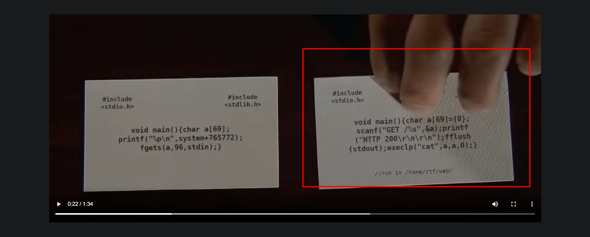

# WPICTF-2020
Writeups for WPICTF 2020

## Recon Challenges

1. __Inspector__
    - Challenge Description
    
    - Looking at the source of wpictf.xyz we find this...
    
    - Lets check out robots.txt
    
    - Then inspector.txt...
    
    - Time to check out the source of the WPI CSC club webpage
    - Hmmm some base64
    
    - Nice troll
    
    - Theres another comment, lets check it out.
    
    - Checking out the source https://ctf.wpictf.xyz/prizes we find the flag
    
    - WPI{1nsp3ct0r_H@ck3R}

2. __dns_wizard__
    - Challenge Description
    
    - First thing that came to my mind was to run dnsrecon against the site
    
    - We find a base64 string which gives us the flag
    - WPI{1F0und_Th3_DNS-record}

3. __hellofellowchallengers__
    - Challenge Description
    
    - literally look through the teams competing and one of them is the flag
    - WPI{the_best_teams_make_the_flags}

4. __PR3S3N70R__
    - Challenge Description
    
    - After searching for a bit we find Alex Gaines, a WPI student who went to r2con 2019
    
    - After googling some more we stumble upon his presentation on youtube
    - If you sort the comments by new you will get a flag
    
    - You have to change NAMEHERE to what he calls his inserted code bits and with that we get the flag
    - WPI{@wg_1s4ch@nCruftables}

## Web Challenges

1. __Zoop__
    - Im not posting the challenge description, all you need to know is Zoop
    - Looks like we have some sort of email service and you can attach files from a storage server, when attaching the quarterly url we can preview the file
    
    - Lets try previewing flag.txt LOL
    
    - WPI{tH4nKs_z00m3r_jh0n50n}

2. __Dorsia2__
    - Challenge description
    
    - Watching the video and looking at the second card, we know we will have to path traverse
    
    - When path traversing you couldnt do it through the browser, so I just used BurpSuite.
    
    - Flag was located at /home/ctf/flag.txt
    - WPI{1_H4VE_2_return_SOME_VIDE0TAP3S}

3. __AutoGrader__
    - Challenge description
    
    - Huh, so its a website to grade C code
    - I spent a long time trying to write code to read the flag until I messed up an include statement
    
    - Big Brain Moment: "no such file or directory" WAITTTT
    - Adding the include statement: #include </home/ctf/flag.txt>
    
    - Easy challenge just required that big brain moment
    - WPI{D0nt_run_as_r00t}